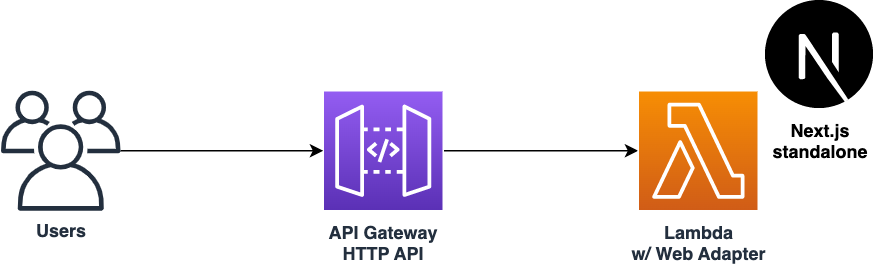

# AWS CDK sample for Next.js standalone on AWS Lambda
This is a sample project to deploy Next.js standalone mode to AWS Lambda and Amazon API Gateway.



## Deploy
You need the following tools to deploy this sample:

* [Node.js](https://nodejs.org/en/download/) (>= v16)
* [Docker](https://docs.docker.com/get-docker/)
* [AWS CLI](https://docs.aws.amazon.com/cli/latest/userguide/getting-started-install.html) and a configured IAM profile

Then run the following commands:

```sh
cd cdk
npm ci
npx cdk bootstrap
npx cdk deploy
```

You can also deploy your changes to frontend code instantly by the following command:

```sh
npx cdk deploy --hotswap
```

## Clean up
To avoid incurring future charges, clean up the resources you created.

You can remove all the AWS resources deployed by this sample running the following command:

```sh
npx cdk destroy --force
```
